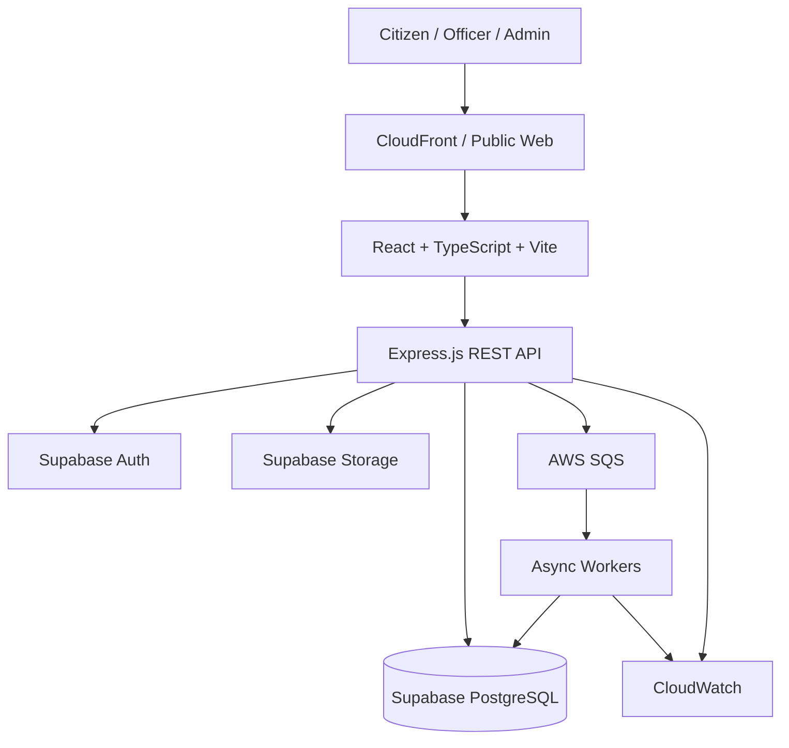
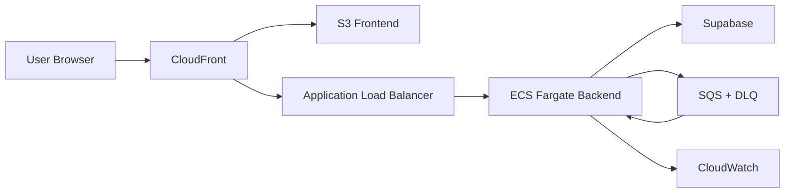

# FamilySetu

## Family ID, Welfare Scheme Discovery & Beneficiary Management Platform

FamilySetu is a family-centric digital platform designed to demonstrate how a reusable **Family ID** can act as the foundation for discovering, evaluating, tracking, and analyzing government welfare benefits across multiple schemes and departments.

The platform brings together:

- Family registration and management
- Family members and relationships
- Life-event tracking
- Welfare scheme catalogue
- Deterministic eligibility evaluation
- Explainable eligibility results
- Missing-information identification
- Scheme discovery and recommendations
- Official government portal redirection
- Application tracking
- Benefit history
- Beneficiary 360° view
- Officer workflows
- Data-quality and duplicate review
- Notifications
- Analytics and reporting foundations
- AI-assisted explanations using structured FamilySetu data
- Secure authentication and role-based access

> **Important:** FamilySetu is a prototype/demo system. It is **not an official Government of India or Government of Gujarat application** and does not replace Digital Gujarat, Gujarat SSO, or any official government department portal.

---

# 1. Problem Statement

Government welfare information is often distributed across multiple departments, schemes, portals, and eligibility criteria.

A family may interact with several schemes during its lifetime, but information about:

- family members
- income
- education
- disability
- life events
- applications
- benefits
- verification
- missing information

is often fragmented.

FamilySetu addresses this challenge through a family-centric approach:

```text
Family ID
    ↓
Family Profile
    ↓
Members + Relationships + Life Events
    ↓
Scheme Catalogue
    ↓
Eligibility Evaluation
    ↓
Explainable Eligibility
    ↓
Missing Information
    ↓
Official Portal Redirection
    ↓
Application Tracking
    ↓
Benefit History
    ↓
Beneficiary 360°
    ↓
Officer Analytics & Outreach
```

---

# 2. Core Concept

The central concept of FamilySetu is the **Family ID**.

A Family ID is a reusable, human-readable identifier that represents a family within FamilySetu.

It is:

- separate from Aadhaar
- not a replacement for Aadhaar
- not a bank account number
- not a mobile number
- not an OTP
- not a government credential

The Family ID connects related information across the platform.

Example:

```text
Family ID: DEMO-FAM-ALPHA

        Family
           |
   +-------+-------+
   |       |       |
 Member  Member  Member
   |       |       |
   +-------+-------+
           |
       Relationships
           |
       Life Events
           |
    Scheme Eligibility
           |
       Applications
           |
      Benefit History
```

---

# 3. Key Features

## 3.1 Family Registry

Families can be created and managed through a centralized family registry.

The registry supports:

- Family ID
- Family status
- Verification status
- Household size
- Annual income
- Address
- District
- State
- Pincode
- Family profile information

Family updates use **optimistic concurrency control** to prevent accidental lost updates when multiple users edit the same record.

---

## 3.2 Family Members

Each family can contain multiple members.

Member information may include:

- Member ID
- Full name
- Date of birth
- Gender
- Relationship to head
- Education status
- Student status
- Employment status
- Annual income
- Marital status
- Disability status
- Caste/category information

---

## 3.3 Relationships

FamilySetu maintains relationships between family members.

Examples:

```text
Parent
Child
Spouse
Sibling
```

This enables family-centric analysis rather than treating every citizen as an isolated record.

---

## 3.4 Life Events

Important life events can be recorded against families or members.

Examples:

- Education change
- Address change
- Marriage
- Employment change
- Other significant household events

Life events can be used as signals for future eligibility reassessment.

---

# 4. Welfare Scheme Catalogue

FamilySetu provides a centralized scheme catalogue.

Each scheme can contain:

- Scheme ID
- Name
- Description
- Department
- Category
- Status
- Official portal URL
- Scheme version
- Eligibility rules
- Required documents
- Benefit information
- Effective dates

Example categories:

```text
Education
Social Security
Healthcare
Housing
Employment
Financial Assistance
```

---

# 5. Deterministic Eligibility Engine

One of the main features of FamilySetu is its **rule-driven eligibility engine**.

Eligibility is evaluated using structured rules rather than allowing AI to make the decision.

Example rule:

```text
IF
    student_status = STUDENT

THEN
    scheme may be potentially applicable
```

Another example:

```text
IF
    age >= 60

THEN
    scheme may be potentially applicable
```

The engine can return states such as:

```text
ELIGIBLE
INELIGIBLE
POTENTIALLY_ELIGIBLE
INSUFFICIENT_INFORMATION
```

The result is stored so that eligibility evaluations can be inspected and explained.

---

# 6. Explainable Eligibility

FamilySetu does not only show an eligibility result.

It also shows **why** the result occurred.

Example:

```text
Scheme:
Demo Education Assistance

Result:
Potentially Eligible

Reason:
Student status matches STUDENT

Missing Information:
None
```

For incomplete profiles:

```text
Result:
Insufficient Information

Missing Information:
Annual income
```

This makes the decision process easier to understand and audit.

---

# 7. Potentially Eligible but Not Applied

FamilySetu can identify families that appear potentially eligible based on the deterministic rules but do not currently have an application for the scheme.

This is useful for:

- officer outreach
- beneficiary discovery
- scheme coverage analysis
- identifying information gaps
- reducing missed opportunities

> **Important:** "Potentially Eligible" is an analytical indication. It is not an official legal eligibility decision.

---

# 8. Official Portal Redirection

FamilySetu does not pretend to submit applications to external government systems.

Instead, it provides:

```text
FamilySetu
    ↓
Eligibility Information
    ↓
Official Scheme Portal
```

When a citizen chooses to apply, FamilySetu redirects them to the official portal.

The application tracker can store:

- external application reference
- internal application state
- submission information
- tracking metadata

FamilySetu does not claim to know a live external application status unless a real integration exists.

---

# 9. Application Tracking

Applications can be tracked using states such as:

```text
DRAFT
SUBMITTED
UNDER_REVIEW
APPROVED
REJECTED
CANCELLED
```

The application record can include an external reference ID when one exists.

Example:

```text
Scheme:
Demo Education Assistance

Application:
DEMO-APP-1001

Status:
APPROVED
```

---

# 10. Benefit History

FamilySetu maintains a historical record of benefits associated with families and schemes.

Benefit history represents a record/timeline.

It is **not a digital wallet** and does not represent actual money held by FamilySetu.

Possible information:

- scheme
- benefit
- date
- amount/reference information
- status
- family/member association

---

# 11. Beneficiary 360°

The Beneficiary 360° view provides authorized officers with a consolidated view of a family.

It can bring together:

```text
Family Profile
    +
Members
    +
Relationships
    +
Addresses
    +
Life Events
    +
Eligibility
    +
Missing Information
    +
Applications
    +
Benefits
    +
Verification
    +
Data Quality
    +
Audit Information
```

This provides a single operational view of the family.

---

# 12. Officer Dashboard

Authorized officers can access operational information such as:

- family statistics
- verification information
- application statuses
- benefit information
- data quality issues
- duplicate signals
- potentially eligible families
- outreach information
- beneficiary details

Officer access is protected through role-based authorization and scope-based access.

---

# 13. Duplicate Detection and Data Quality

FamilySetu supports detection and review of possible duplicate or inconsistent records.

Examples:

- possible duplicate family
- conflicting family information
- incomplete profile
- inconsistent member data
- missing mandatory information

Potential duplicates are flagged for **human review**.

The system does not automatically merge families or members.

---

# 14. AI Assistant

FamilySetu includes a safe assistant API designed around structured FamilySetu data.

Example questions:

```text
Which schemes could be relevant to this family?

Why was this family marked insufficient information?

What information is missing?

What documents are required?
```

The AI layer follows an important rule:

```text
AI ≠ Eligibility Engine
```

The deterministic eligibility engine remains the source of truth.

AI can:

- explain
- summarize
- retrieve structured information
- assist with interpretation

AI must not:

- override eligibility
- invent eligibility criteria
- make official legal decisions
- fabricate application status
- impersonate government systems

The current demo mode works without an external AI provider.

---

# 15. Authentication and Authorization

FamilySetu uses:

- Supabase Authentication
- JWT bearer tokens
- Role-based access control
- Permission-based authorization
- User scopes
- Family-level ownership/scoping

Example roles:

```text
CITIZEN
OFFICER
ADMIN
```

The backend validates the Supabase access token and resolves the corresponding FamilySetu application user.

---

# 16. Architecture

FamilySetu follows a **Scalable Modular Monolith + Layered Architecture + Event-Driven Foundation**.

## High-Level Architecture



---

# 17. Backend Architecture

The backend follows:

```text
Route
   ↓
Controller
   ↓
Service / Domain Logic
   ↓
Repository
   ↓
Supabase PostgreSQL
```

This keeps:

- HTTP concerns
- business logic
- data access
- validation
- authorization

separated.

Backend technology:

```text
Node.js
Express.js
TypeScript
Zod
Supabase
JWT Authentication
OpenAPI
```

---

# 18. Frontend Architecture

The frontend uses:

```text
React
TypeScript
Vite
React Router
TanStack Query
Tailwind CSS
React Hook Form
Zod
Recharts
```

The frontend communicates with the backend through REST APIs.

Example:

```text
React Page
    ↓
API Client
    ↓
/api/v1/...
    ↓
Express Backend
```

Authentication tokens are included in backend API requests.

---

# 19. Asynchronous Architecture

FamilySetu is designed to support asynchronous processing using:

```text
Transactional Outbox
        ↓
Amazon SQS
        ↓
Worker
        ↓
Database / Notifications / Processing
```

The outbox pattern ensures that important business state changes and corresponding events can be committed consistently.

Workers are designed to be idempotent because SQS provides at-least-once delivery semantics.

The API remains stateless so additional backend instances can be introduced later.

---

# 20. Database

FamilySetu uses:

**Supabase PostgreSQL**

Important domain areas include:

```text
department
role
permission
application_user
user_role
user_scope

family
family_member
family_address
member_relationship
life_event

scheme
scheme_category
scheme_version
eligibility_rules
required_document

eligibility_evaluation
missing_information
application
benefit_history

verification_request
document
document_version

duplicate_flag
data_quality_issue

audit_log
outbox_event
processed_event

notification
notification_preference
job
report_job
export_job
redirect_event
consent
```

The database schema is maintained using version-controlled Supabase migrations.

---

# 21. Database Migration

Migration files are located in:

```text
supabase/migrations/
```

Current migration sequence:

```text
20231024000001_core_identity_and_roles.sql
20231024000002_family_domain.sql
20231024000003_scheme_domain.sql
20231024000004_eligibility_and_applications.sql
20231024000005_governance_and_audit.sql
20231024000006_api_compatibility.sql
```

Migrations are intended to be forward-only.

Destructive database reset operations should not be used against shared or production environments.

---

# 22. Demo Seed Data

Synthetic demonstration data is provided in:

```text
supabase/seed-demo.sql
```

The seed contains fictional records for:

- families
- members
- relationships
- life events
- schemes
- scheme versions
- eligibility evaluations
- applications

Example demo families:

```text
DEMO-FAM-ALPHA
DEMO-FAM-BRAVO
DEMO-FAM-CHARLIE
```

All demo data is synthetic.

No real citizen data should be used.

---

# 23. Project Structure

```text
family-setu/
│
├── backend/
│   ├── src/
│   │   ├── modules/
│   │   │   ├── family/
│   │   │   ├── schemes/
│   │   │   ├── eligibility/
│   │   │   ├── applications/
│   │   │   ├── benefits/
│   │   │   ├── verification/
│   │   │   ├── data-quality/
│   │   │   ├── notifications/
│   │   │   ├── dashboard/
│   │   │   └── assistant/
│   │   │
│   │   ├── shared/
│   │   │   ├── middleware/
│   │   │   ├── routes/
│   │   │   ├── db/
│   │   │   ├── errors/
│   │   │   └── types/
│   │   │
│   │   ├── app.ts
│   │   └── index.ts
│   │
│   ├── Dockerfile
│   ├── package.json
│   └── tsconfig.json
│
├── frontend/
│   ├── src/
│   │   ├── pages/
│   │   ├── components/
│   │   ├── routes/
│   │   ├── context/
│   │   ├── hooks/
│   │   └── ...
│   │
│   ├── Dockerfile
│   ├── nginx.conf
│   ├── package.json
│   └── vite.config.ts
│
├── supabase/
│   ├── migrations/
│   └── seed-demo.sql
│
├── infra/
│   └── terraform/
│
├── .github/
│   └── workflows/
│
├── package.json
├── package-lock.json
└── README.md
```

---

# 24. REST API

The backend exposes APIs under:

```text
/api/v1/
```

Major API areas include:

```text
/api/v1/families
/api/v1/schemes
/api/v1/eligibility
/api/v1/applications
/api/v1/benefits
/api/v1/verification
/api/v1/data-quality
/api/v1/notifications
/api/v1/dashboard
/api/v1/assistant
```

Health endpoints:

```text
GET /health
GET /ready
```

OpenAPI documentation is exposed through:

```text
/api-docs
```

---

# 25. Environment Variables

## Backend

Create:

```text
backend/.env
```

Example:

```env
SUPABASE_URL=https://YOUR_PROJECT.supabase.co
SUPABASE_SECRET_KEY=YOUR_SUPABASE_SECRET_KEY
PORT=3000
AI_PROVIDER=demo
CORS_ORIGIN=http://localhost:5173
```

## Frontend

Create:

```text
frontend/.env.local
```

Example:

```env
VITE_SUPABASE_URL=https://YOUR_PROJECT.supabase.co
VITE_SUPABASE_PUBLISHABLE_KEY=YOUR_PUBLISHABLE_KEY
VITE_API_URL=http://localhost:3000
```

Never commit `.env` or `.env.local`.

---

# 26. Local Development

Clone the repository:

```bash
git clone https://github.com/KavySanghani/family-setu.git
cd family-setu
```

Install dependencies:

```bash
npm ci
```

Start backend:

```bash
npm --prefix backend run dev
```

Start frontend in another terminal:

```bash
npm --prefix frontend run dev
```

Frontend:

```text
http://localhost:5173
```

Backend:

```text
http://localhost:3000
```

---

# 27. Backend Validation

Health check:

```bash
curl http://localhost:3000/health
```

Expected:

```json
{
  "status": "healthy"
}
```

Database readiness:

```bash
curl http://localhost:3000/ready
```

Expected:

```json
{
  "status": "ready"
}
```

---

# 28. Production Build

Backend:

```bash
npm --prefix backend run build
```

Frontend:

```bash
npm --prefix frontend run build
```

Run backend tests:

```bash
npm --prefix backend test
```

---

# 29. Docker

Production Dockerfiles are provided for both applications.

Backend:

```text
backend/Dockerfile
```

Frontend:

```text
frontend/Dockerfile
```

The backend container:

- uses Node.js
- builds TypeScript
- runs the compiled application
- exposes port `3000`
- includes a container health check

---

# 30. CI/CD Foundation

GitHub Actions CI is provided under:

```text
.github/workflows/
```

The CI pipeline is intended to validate project builds on pushes and pull requests.

The project also contains an infrastructure foundation under:

```text
infra/terraform/
```

The infrastructure foundation includes resources for:

- ECR
- SQS
- Dead Letter Queue
- CloudWatch

---

# 31. Deployment Architecture

The intended cloud architecture is:



The architecture can later be expanded with:

- AWS WAF
- Route 53
- ACM
- Secrets Manager
- KMS
- ECR
- autoscaling
- additional workers
- deployment automation

---

# 32. Security and Privacy Principles

FamilySetu follows these principles.

## Synthetic Data Only

The demonstration environment uses fictional information.

Never upload:

- real Aadhaar numbers
- real bank information
- real OTPs
- real citizen documents
- real government credentials

## Secrets

Sensitive environment variables must remain outside source control.

Examples:

```text
SUPABASE_SECRET_KEY
database passwords
AWS credentials
AI provider keys
```

## Role-Based Access

Administrative and officer functions are protected using:

```text
Authentication
+
RBAC
+
Permissions
+
User Scopes
```

## Auditability

Important actions can be recorded through audit logging.

## Duplicate Safety

Duplicate records are reviewed by authorized humans.

FamilySetu does not automatically merge records.

---

# 33. Demo Account

A synthetic demo account is available for presentation/testing.

```text
Username:
demo@familysetu.test
```

The demo password is intentionally **not stored in this public README or source repository**.

Set or manage the password directly in the Supabase Authentication dashboard.

---

# 34. Product Disclaimer

FamilySetu is a prototype developed for demonstration, academic, research, and product-design purposes.

It should not be interpreted as:

- an official government platform
- an official welfare eligibility authority
- an Aadhaar replacement
- a government application submission system
- a live government application-status provider

Actual eligibility and application decisions remain subject to the applicable government scheme rules and official authorities.

---

# 35. Design Principles

FamilySetu is built around the following principles:

### Family-Centric Identity

Create reusable family-level context instead of repeatedly collecting information for every scheme.

### Deterministic Eligibility

Use structured rules as the source of truth.

### Explainability

Every eligibility result should be understandable.

### Official Integration Boundaries

Redirect citizens to official portals instead of pretending to replace them.

### Privacy by Design

Use minimum necessary information and synthetic data for demos.

### Human Review

Do not automatically merge potentially duplicate records or make irreversible administrative decisions.

### Auditability

Important state changes should be traceable.

### Horizontal Scalability

The backend is designed as a stateless modular monolith that can scale horizontally.

---

# 36. Example User Journey

```text
User Login
    ↓
Family Dashboard
    ↓
Family Profile
    ↓
Members + Life Events
    ↓
Scheme Finder
    ↓
Eligibility Evaluation
    ↓
Explainable Result
    ↓
Missing Information
    ↓
Official Scheme Portal
    ↓
Application Tracking
    ↓
Benefit History
```

Officer journey:

```text
Officer Login
    ↓
Officer Dashboard
    ↓
Family Search
    ↓
Beneficiary 360°
    ↓
Verification
    ↓
Data Quality Review
    ↓
Potentially Eligible Families
    ↓
Outreach / Follow-up
    ↓
Analytics
```

---

# 37. Future Scope

Potential future enhancements include:

- live government portal integrations
- real-time application-status synchronization
- multilingual interfaces
- advanced geographic analytics
- document OCR
- stronger AI/RAG capabilities
- external notification providers
- advanced reporting
- scalable worker infrastructure
- AWS WAF and advanced security controls
- production observability
- automated deployment pipelines
- domain-specific AI models

---

# 38. Technology Stack

## Frontend

```text
React
TypeScript
Vite
React Router
TanStack Query
Tailwind CSS
React Hook Form
Zod
Recharts
```

## Backend

```text
Node.js
Express.js
TypeScript
Zod
Supabase JS
JWT Authentication
OpenAPI
```

## Database / Backend Platform

```text
Supabase
PostgreSQL
Supabase Auth
Supabase Storage
Row Level Security
```

## Cloud / DevOps

```text
AWS
ECR
ECS Fargate
ALB
CloudFront
S3
SQS
CloudWatch
Terraform
GitHub Actions
```

---

# 39. Current Status

The current repository includes:

- Family Registry
- Family ID
- Family Members
- Life Events
- Scheme Catalogue
- Scheme Versions
- Deterministic Eligibility
- Explainable Eligibility
- Missing Information
- Application Tracking
- Benefit History
- Notifications
- Officer Dashboard
- Beneficiary 360°
- Authentication
- Authorization
- Synthetic Demo Seed
- Assistant API
- Docker deployment foundations
- CI foundation
- Terraform infrastructure foundation

Advanced operational capabilities may still require further implementation before a full production government deployment.

---

# 40. Project Goal

FamilySetu demonstrates how a **family-level digital identity layer** can become a reusable foundation for welfare-service discovery and beneficiary management.

The long-term concept is:

```text
Family ID
     ↓
Family Profile
     ↓
Eligibility Intelligence
     ↓
Scheme Discovery
     ↓
Application Support
     ↓
Benefit Tracking
     ↓
Beneficiary 360°
     ↓
Government Analytics
     ↓
Targeted Outreach
```

FamilySetu aims to move from:

> "A citizen searches separately for every scheme"

towards:

> "A reusable family profile helps identify relevant welfare opportunities while keeping eligibility explainable, auditable, and connected to official government channels."
